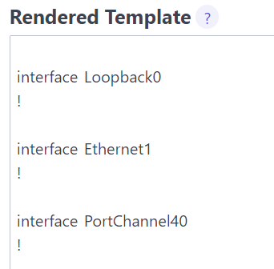
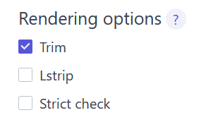
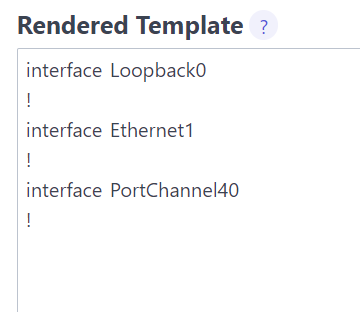
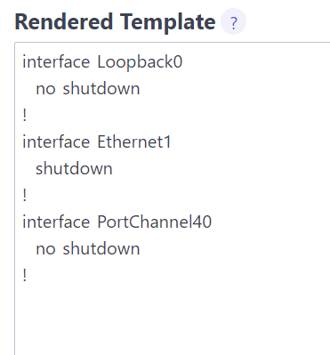
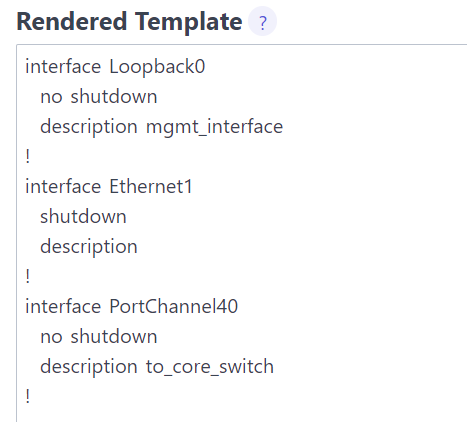
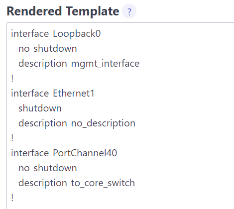
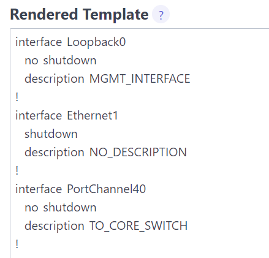

# Working with Jinja Templates

### Task 1 -  Creating Cisco Interface Configurations

In this lab you'll be using the live Jinja renderer provided by J2Live (https://j2live.ttl255.com/)

The renderer allows you to provide some input data, in YAML or JSON format, and some actual Jinja templating, and shows you the rendered output.  This will give you an idea of how the Jinja templating engine works.

You will be using the J2Live renderer to create interface configurations for a Cisco device.

##### Step 1 - Browse to the online Jinja renderer

In your web browser, navigate to the [online Jinja renderer](https://j2live.ttl255.com).

##### Step 2 - Create the variable data

**Paste the following data into the `Jinja2 Data` text area:**

```yaml
---
interfaces:
 - Loopback0
 - Ethernet1
 - PortChannel40
```

**This data structure consists of a **list** called 'interfaces' with 3 items.

##### Step 3 - Create the initial template

Paste the following template into the `Jinja2 Template` text area.

```jinja

interface {{ interface }}
!

```

This template will **loop** through the `interfaces` variable in our Jinja data text area.

##### Step 4 - Render the template

Now hit the `Render template` button to view the output:  



**Notice how there is an extra line in between each interface?**

We can fix this problem by clicking the `trim` option towards the bottom of the page.  This will remove the newline character after each Jinja tag: 



Now re-render the template:



**Notice that the output almost mirrors an actual Cisco configuration now.**

Lets add some more information to our `Jinja2 Data` section to allow us to specify interface level settings

##### Step 5 - Add interface information

Replace the `Jinja2 Data` text area with the following:

```yaml
interfaces:
 - name: Loopback0
   state: no shutdown
 - name: Ethernet1
   state: shutdown
 - name: PortChannel40
   state: no shutdown
```

Here, we've turned each item in the `interfaces` list into a **dictionary**, with each interface having two key/value pairs.

Now, we can edit our template to include the state in each interface's configuration.

##### Step 6 - Use new interface data in the template

Replace the `Jinja2 Template` text area with the following:

```jinja

interface {{ interface.name }}
  {{ interface.state }}
!

```

Here, we've just changed our variable calls to reference the `name` and `state` keys of each interface.

> Remember that Jinja allows us to reference dictionary keys using dotted notation in addition to bracket notation

##### Step 7 - Render the template

Now render the template again, and see that we now have the shutdown or no shutdown setting configured based in our input data:




##### Step 8 - Add the 'state' of each interface

Now lets change the value of the `state` key for each interface and use an IF statement in our template to accomplish this in a different manner.  


In our `Jinja2 Data` text area, replace `shutdown` with `disabled` and `no shutdown` with `enabled`:

```yaml
interfaces:
 - name: Loopback0
   state: enabled
 - name: Ethernet1
   state: disabled
 - name: PortChannel40
   state: enabled
```

##### Step 9 - Use the 'state' in the template

In the `Jinja2 Template` text area, replace `{{ interface.state }}` with `{{ 'no shutdown' if interface.state == 'enabled' else 'shutdown' }}`:

```jinja

interface {{ interface.name }}
  {{ 'no shutdown' if interface.state == 'enabled' else 'shutdown' }}
!

```

**Here we are using ternary assignment to output `no shutdown` if the interface's state is `enabled`, otherwise output `shutdown`.**

##### Step 10

Hit the `Clear render` button.

Hit the `Render template` to render your template again, and notice we have achieved the same result as before, but in a different manner.

### Task 2 - Using Jinja filters

In this section you will use a couple of common jinja filters.  Jinja filters are used to transform data.

##### Step 1 - Add interface descriptions

Lets add a `description` key to a couple of interfaces in our data:

```yaml
interfaces:
 - name: Loopback0
   state: enabled
   description: mgmt_interface
 - name: Ethernet1
   state: disabled
 - name: PortChannel40
   state: enabled
   description: to_core_switch
```

**Notice we didn't add the `description` key to the `Ethernet` interface.  We will get to that in the next step.**

##### Step 2 - Reference the `description` in your template

Replace your template with the following:

```jinja

interface {{ interface.name }}
  {{ 'no shutdown' if interface.state == 'enabled' else 'shutdown' }}
  description {{ interface.description }}
!

```

Here we've added a line that will output the `description` setting for each interface.

##### Step 3 - Render the template

Now render your template:



Notice that Ethernet 1 has a line that just has the word `description` with no value set.

##### Step 4 - Provide a default value for `description`

We can use the built-in `default()` Jinja filter to provide a default in case a value isn't defined.

**Replace your template with the following:**

```jinja

interface {{ interface.name }}
  {{ 'no shutdown' if interface.state == 'enabled' else 'shutdown' }}
  description {{ interface.description | default('no_description') }}
!

```

We've added the `default()` filter to the description line in our template, and in the filter call, we've specified the default value should be `no_description`.

In order to pass data to a filter, use a `|`, similar to the linux command line.

##### Step 5 - Render the template

Render your template, and notice that `Ethernet1` now has a description of `no_description`:



##### Step 6 - Chain multiple Jinja filters

Now we can actually chain together multiple Jinja filters in order to also convert our descriptions to uppercase.  For this, we can use the `upper` filter.

Replace your template with the following:

```jinja

interface {{ interface.name }}
  {{ 'no shutdown' if interface.state == 'enabled' else 'shutdown' }}
  description {{ interface.description | default('no_description') | upper }}
!

```

Notice just add an extra `|` and pass the previous output to the `upper` filter.

### Step 7 - Render the template

Render your template and notice that all the descriptions have been converted to uppercase:


